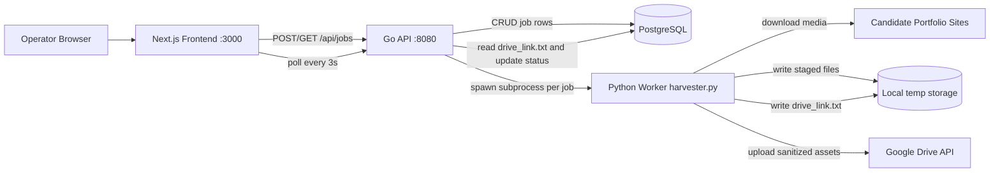

# Playto Folio Harvester Architecture

This document explains the current architecture and runtime workflow of the project for DevOps engineers responsible for deployment, operations, troubleshooting, and maintenance.

Scope note: this reflects the code currently in this repository. Where implementation gaps exist, they are explicitly called out.

## 1. High-Level Architecture Overview

### 1.1 System purpose

The system accepts candidate portfolio URLs, harvests media assets from those URLs, sanitizes and renames output files, uploads the output to Google Drive, and exposes job status/results in an operator dashboard.

### 1.2 Core components

- Frontend: Next.js dashboard used by operators to create and monitor jobs.
- Backend API: Go service responsible for validation, persistence, and worker orchestration.
- Worker: Python harvester process launched by the Go API per job.
- Database: PostgreSQL job state store.
- External services: candidate websites (source) and Google Drive API (destination).
- Local staging storage: per-job temporary filesystem workspace under `HARVEST_OUTPUT_BASE`.

### 1.3 Architecture diagram (current)

No architecture diagram files (Mermaid, Draw.io, PNG system diagrams, etc.) are currently committed in the repository. The diagram below documents the current runtime topology.

### 1.4 Why this architecture split exists

- The Go API keeps request handling and state management fast and simple, while Python handles scraping/media libraries that are stronger in Python ecosystems (Playwright Python bindings, yt-dlp, Pillow, Google API client).
- Asynchronous processing prevents long-running harvesting from blocking HTTP request threads.
- PostgreSQL provides durable cross-process state (`queued` -> `in_progress` -> `completed`/`failed`) that the frontend can poll.
- Local staging enables sanitization and deterministic renaming before any external publication to Drive.

## 2. Overall System Design and Interactions

### 2.1 Frontend <-> backend interaction

- The frontend submits jobs using `POST /api/jobs`.
- The frontend polls `GET /api/jobs` every 3 seconds for status updates.
- Frontend reads `drive_link` for completed jobs and `error_logs` for failed jobs.

Important deployment detail: frontend rewrite is hardcoded to `http://localhost:8080/api/:path*` in `frontend/next.config.js`. In production this usually requires either:

- colocating frontend and backend with loopback access, or
- changing rewrite strategy before deployment.

### 2.2 Backend <-> database interaction

- API inserts new jobs with status `queued`.
- Worker orchestration updates status to `in_progress`.
- Completion writes `drive_link` and status `completed`.
- Failure writes `error_logs` and status `failed`.

### 2.3 Backend <-> worker interaction

- The Go API spawns Python as a child process using `exec.CommandContext`.
- Arguments passed: `--job-id`, `--url`, `--output`.
- Worker stdout/stderr are captured and used to build failure messages.
- Go expects worker success to produce `<output_dir>/drive_link.txt`.

### 2.4 Worker <-> external services interaction

- Candidate websites are visited and rendered via headless Chromium (Playwright).
- Static media fetched via `aiohttp`.
- Video downloads attempted via `yt-dlp`.
- Final output uploaded to Google Drive API v3 using OAuth desktop credentials.

## 3. Project Structure Explanation

Top-level directories and important files:

- `cmd/server/main.go`
  - API entrypoint, `.env` loading, config resolution, DB init, HTTP server startup/shutdown.
- `internal/api/router.go`
  - Chi router and middleware stack.
- `internal/api/jobs_handler.go`
  - Job endpoints and request validation.
- `internal/db/postgres.go`
  - PostgreSQL pool creation and ping.
- `internal/models/job.go`
  - Shared job/status model.
- `internal/repository/jobs.go`
  - SQL persistence layer.
- `internal/worker/processor.go`
  - Asynchronous worker launcher and status transitions.
- `worker/harvester.py`
  - End-to-end harvesting, sanitization, fallback logic, Drive upload.
- `schema.sql`
  - Jobs table and index bootstrap schema.
- `frontend/app/page.tsx`
  - Dashboard page shell.
- `frontend/components/dashboard/job-submission-form.tsx`
  - Form + client-side validation.
- `frontend/components/dashboard/jobs-dashboard.tsx`
  - Polling orchestration + create action.
- `frontend/components/dashboard/jobs-table.tsx`
  - Status/result/error rendering.
- `frontend/types/job.ts`
  - Frontend type contract for API payloads.
- `.env`
  - Runtime config source for local/dev and many deployments.

## 4. Application Workflow (Data Flow)

### 4.1 End-to-end request lifecycle

1. Operator opens dashboard and submits a portfolio URL from frontend form.
2. Frontend validates URL format (Zod) and sends `POST /api/jobs`.
3. Go handler validates payload (must be `http`/`https` URL).
4. Repository inserts row into `jobs` with status `queued`.
5. API returns job ID immediately (HTTP 201).
6. API starts a goroutine that:
   - updates DB status to `in_progress`,
   - creates output directory `<HARVEST_OUTPUT_BASE>/<job_id>`,
   - launches Python worker subprocess.
7. Python worker executes stages:
   - launches headless browser and fully renders page,
   - discovers image/pdf/video candidates via DOM + network interception,
   - downloads assets to local output directory,
   - attempts video downloads with fallback screenshot/readme on failures,
   - sanitizes image metadata and renames files to generic names,
   - uploads all result files to Google Drive folder `Extraction_<job_id>`,
   - writes shareable link to `drive_link.txt` in local output directory.
8. Go process reads `drive_link.txt`:
   - if present and non-empty -> updates DB to `completed` with `drive_link`.
   - if missing/empty or worker failed -> updates DB to `failed` with `error_logs`.
9. Frontend polling (`GET /api/jobs` every 3s) surfaces new status and link/error details.

### 4.2 Status model

- `queued`: job persisted, worker not yet marked active.
- `in_progress`: worker goroutine started and status updated.
- `completed`: worker succeeded and Drive link persisted.
- `failed`: worker exited non-zero or post-processing checks failed.

### 4.3 Why polling is used

The frontend uses periodic polling (3s) instead of WebSockets/SSE. This matches current API simplicity (stateless HTTP only) and avoids additional infrastructure components for push channels.

## 5. Database Usage

### 5.1 Database choice and role

- Database: PostgreSQL (accessed via `pgx` pool).
- Why this fits current implementation:
  - durable job lifecycle state,
  - straightforward SQL CRUD,
  - native UUID support and indexing.

### 5.2 Current schema overview

`schema.sql` defines:

- `id UUID PRIMARY KEY DEFAULT gen_random_uuid()`
- `client_name VARCHAR(255) NOT NULL`
- `job_title VARCHAR(255) NOT NULL`
- `candidate_name VARCHAR(255) NOT NULL`
- `portfolio_url VARCHAR(1024) NOT NULL`
- `status VARCHAR(20) NOT NULL CHECK (...)`
- `drive_link VARCHAR(1024)`
- `error_logs TEXT`
- `created_at TIMESTAMP NOT NULL DEFAULT CURRENT_TIMESTAMP`
- Index: `idx_jobs_created_at_desc` on `created_at DESC`

Repository behavior detail: optional metadata fields are normalized to `N/A` before insert to satisfy current `NOT NULL` constraints.

### 5.3 When data is written/read

- Writes:
  - Job creation (`INSERT`).
  - Status updates (`UPDATE`) at in-progress, completed, failed transitions.
- Reads:
  - Job listing (`SELECT ... ORDER BY created_at DESC`).
  - Job-by-ID retrieval (`SELECT ... WHERE id = $1`).

## 6. Local Storage to Google Drive Flow

### 6.1 Current local staging behavior

- Go creates per-job output directory: `<HARVEST_OUTPUT_BASE>/<job_id>`.
- Python writes all harvested and transformed artifacts into this directory.
- Go defers cleanup (`os.RemoveAll(outputDir)`), so staged files are ephemeral by design after processing ends.

### 6.2 Why data is staged locally first

Based on implementation, local staging is needed for:

- Multi-step transformation before publish:
  - browser/network extraction,
  - file downloads,
  - sanitization,
  - generic renaming.
- Deterministic packaging of final files before upload.
- Fault-tolerant fallback artifacts (screenshots and fallback readme) generated during harvest.
- A simple success handshake from Python to Go via `drive_link.txt`.

### 6.3 Drive upload sequence

1. Worker resolves OAuth credentials/token.
2. Worker validates configured parent folder (`DRIVE_TARGET_FOLDER_ID`) and write capability.
3. Worker creates destination folder `Extraction_<job_id>`.
4. Worker uploads all files except `drive_link.txt`.
5. Worker sets folder permission to `anyone:reader`.
6. Worker fetches `webViewLink`, writes it to local `drive_link.txt`.

### 6.4 Reliability and cleanup behavior

- If upload fails after destination folder creation, worker attempts to delete that folder to avoid partial leaked outputs.
- If Go cannot read a valid `drive_link.txt`, job is marked failed.
- There is no queue-level retry system; retries are manual (submit another job).

## 7. Background Jobs, Queueing, and Async Processing

### 7.1 Current async model

- No external queue broker is implemented (no Redis/RabbitMQ/SQS/Kafka integration in current code).
- Each created job starts an in-process goroutine in API.
- Goroutine launches one Python subprocess per job.

### 7.2 Operational implications

- Throughput and concurrency are tied directly to API host CPU/memory/process limits.
- API restarts can interrupt in-flight workers and leave jobs stuck in `in_progress`.
- There is no built-in scheduler, dead-letter queue, retry backoff, or worker autoscaling mechanism.

## 8. Environment Variables and Configuration

### 8.1 Runtime variables used by current code

| Variable | Required | Used by | Default | Purpose |
|---|---|---|---|---|
| `PORT` | No | Go API | `8080` | HTTP listen port for backend API |
| `DATABASE_URL` | Yes | Go API | none | PostgreSQL DSN for persistence |
| `PYTHON_BIN` | No | Go API worker launcher | `python` | Python executable for worker subprocess |
| `WORKER_SCRIPT_PATH` | No | Go API worker launcher | `worker/harvester.py` | Worker script location |
| `HARVEST_OUTPUT_BASE` | No | Go API worker launcher | `./temp_harvest` | Base path for per-job local staging |
| `GOOGLE_OAUTH_CLIENT_SECRET` | No | Python worker | `./oauth-secret.json` (repo root) | OAuth desktop app client secret path |
| `GOOGLE_OAUTH_TOKEN_PATH` | No | Python worker | `./token.json` (repo root) | OAuth token cache path (must be writable) |
| `DRIVE_TARGET_FOLDER_ID` | Yes (for successful completion) | Python worker | none | Parent Google Drive folder for uploaded job outputs |

### 8.2 Variables present but not used by current code

- `GOOGLE_APPLICATION_CREDENTIALS` appears in local `.env`, but current worker uses OAuth desktop flow (`InstalledAppFlow`) and does not read this variable.

### 8.3 Secrets and credentials required for deployment

- PostgreSQL credentials embedded in `DATABASE_URL`.
- OAuth desktop client secret JSON file (path from `GOOGLE_OAUTH_CLIENT_SECRET`).
- OAuth token JSON file with refresh token (path from `GOOGLE_OAUTH_TOKEN_PATH`).
- Drive destination folder ID (`DRIVE_TARGET_FOLDER_ID`).

Security note: current `.gitignore` ignores `*.json`, `.env`, and other secret-bearing artifacts. Keep all secret material out of image layers and source control.

### 8.4 Config precedence behavior

- Go loads `.env` via `godotenv.Load()`.
- Existing shell environment variables override `.env` values when already exported in process environment.

## 9. Deployment Considerations

### 9.1 Required runtime services and dependencies

Required:

- PostgreSQL database with `schema.sql` applied.
- Go API process.
- Python runtime with dependencies from `requirements.txt`.
- Playwright browser binaries (Chromium) installed for worker runtime.
- Next.js frontend process (if deploying built-in dashboard).

Not currently required by code:

- Redis
- dedicated queue service
- object storage other than Google Drive

Likely required at OS level for robust video handling:

- `ffmpeg` (commonly needed by `yt-dlp` for muxing audio/video streams into MP4).

### 9.2 Service startup order

1. Start PostgreSQL and verify network reachability.
2. Apply `schema.sql` to target database.
3. Ensure Python environment and Playwright browser dependencies are installed.
4. Provision OAuth secret/token files and set `DRIVE_TARGET_FOLDER_ID`.
5. Start Go API.
6. Start Next.js frontend.

### 9.3 What happens during backend startup

On `cmd/server/main.go` startup:

1. Logging format initialized.
2. `.env` loaded (if present).
3. Config values resolved (`DATABASE_URL`, worker config, port).
4. Worker script path converted to absolute path.
5. PostgreSQL pool created and pinged.
6. Repository/processor/handlers wired.
7. HTTP server starts and blocks until shutdown signal.

### 9.4 Background processes that must remain running

- PostgreSQL must remain available at all times.
- Go API must remain running to accept jobs and host worker goroutines/subprocesses.
- Frontend (or another API client) must remain available for operator UX.
- There is no separate always-on worker daemon; worker processes are child processes of API.

### 9.5 Network requirements

Inbound:

- Frontend HTTP port (default 3000) for operators.
- Backend HTTP port (default 8080) for frontend/API clients.

Outbound from backend host:

- PostgreSQL endpoint.
- Candidate portfolio domains over HTTPS.
- Google Drive APIs.
- Sites used by video providers (YouTube/Vimeo/Instagram links encountered in portfolios).

OAuth caveat:

- If token is missing/invalid, worker may trigger interactive browser auth (`run_local_server(port=0)`).
- Headless/non-interactive production environments should pre-provision a valid token file to avoid runtime login prompts.

## 10. Potential Failure Points and Handling

| Failure point | Where it occurs | Current handling | DevOps impact |
|---|---|---|---|
| Missing/invalid `DATABASE_URL` | API startup | API exits (fatal) | Service never starts |
| Jobs table missing | API request path | DB errors bubble as 500 | Must apply schema before traffic |
| Invalid job payload/URL | `POST /api/jobs` | 400 response | Input rejected early |
| Worker executable/script misconfigured | Worker launch | Job marked `failed` (if launch reached), otherwise startup path issues | Immediate job failures |
| Output dir creation failure | Go processor | Job marked `failed` with error log | Usually filesystem/permission issue |
| Worker runtime exception | Python | process exit 1; Go writes truncated stderr/stdout into `error_logs` | Visible in UI for diagnosis |
| Drive config missing (`DRIVE_TARGET_FOLDER_ID`) | Python upload | Worker fails; job marked `failed` | No completed jobs |
| Drive upload partial failure | Python upload | Attempts to delete created Drive folder, then fails job | Reduces partial data leakage |
| `drive_link.txt` missing/empty | Go post-worker check | Job marked `failed` | Strict completion contract enforced |
| API restart during jobs | Process lifecycle | No built-in recovery/requeue | Jobs may remain `in_progress` |
| High submission burst | API in-process goroutine model | No queue/backpressure | Potential host saturation |

## 11. Infrastructure Assumptions

### 11.1 Runtime model

- Current repository has no Dockerfile/compose manifests; runtime is host-managed by default (VM/bare-metal/dev shell), though it can be containerized externally.
- API and worker are tightly coupled at process-host level because worker is spawned from API.

### 11.2 Storage assumptions

- Writable filesystem required for:
  - temporary harvest output directories,
  - OAuth token file persistence.
- Temporary output can be ephemeral; token path should be durable across restarts to avoid repeated interactive login.

### 11.3 Security and access assumptions

- OAuth account used by worker must have permission to create/upload inside `DRIVE_TARGET_FOLDER_ID`.
- Current upload code sets destination folder to publicly readable (`anyone`, `reader`), which is an explicit access model decision and should align with organizational policy.

## 12. Step-by-Step Deployment Understanding

### 12.1 What must exist before app startup

1. PostgreSQL service and reachable DSN.
2. `jobs` schema applied from `schema.sql`.
3. Python environment with required packages and Playwright browser install.
4. Valid runtime env vars/secrets (`DATABASE_URL`, Drive OAuth files, Drive folder ID).
5. File permissions allowing API to create temp output directories and worker to read/write token file.

### 12.2 What happens after startup when first job is submitted

1. API validates and records job (`queued`).
2. API starts worker and marks `in_progress`.
3. Worker harvests, sanitizes, renames, uploads to Drive.
4. Worker writes local `drive_link.txt`.
5. API reads link and marks job `completed`; otherwise marks `failed` with logs.
6. Frontend polling reflects state transition to operators.

### 12.3 What must remain healthy in steady state

1. Database connectivity and low-latency query performance.
2. API process uptime (it orchestrates all workers).
3. Network egress to source sites and Google APIs.
4. Sufficient local disk/CPU/memory for browser + media processing workloads.

## 13. Current Implementation Gaps Relevant to DevOps

These are important for operational expectations because they affect deployment design:

- No external queue/worker fleet; concurrency control is minimal and tied to API host resources.
- No automatic retry/reconciliation loop for stuck or failed jobs.
- No dedicated health/readiness endpoints are implemented.
- Frontend API rewrite is localhost-bound by default.
- PDF visual redaction/flattening is not present in current worker code path.

## 14. Practical Operations Checklist

Use this checklist before promoting an environment:

1. Verify schema exists and API can list jobs.
2. Verify worker executable path and script path are correct on host.
3. Verify Playwright Chromium install and outbound internet access.
4. Verify OAuth token is valid and refreshable non-interactively.
5. Verify `DRIVE_TARGET_FOLDER_ID` is accessible with create permissions.
6. Submit a test job and confirm full lifecycle to `completed` with Drive link visible in UI.
